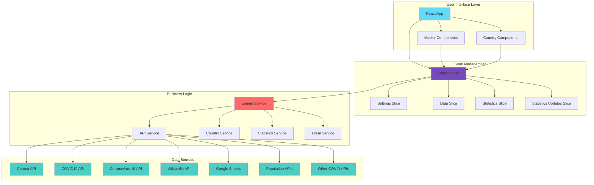

# World COVID-19 Data CRA

A React application to display real-time COVID-19 statistics (cases, deaths, recoveries) for countries worldwide by aggregating data from 8 different APIs.

Built in May 2020. This application fetches and displays COVID-19 pandemic data from multiple sources, providing a comprehensive view of global statistics with country-level details, population data, and historical tracking.


## Features

- 📊 Real-time COVID-19 data from 8 different APIs
- 🌍 Country-wise statistics (cases, deaths, recoveries)
- 👥 Population data integration
- 🗺️ Interactive country information with maps and Wikipedia links
- 📈 Historical statistics tracking
- 🔄 Automatic data updates with error recovery
- 🎛️ Sorting and filtering capabilities
- ⏰ Binary clock display
- 📱 Responsive UI design
- 🧪 Multiple component modes for development and testing

## Architecture



## Getting Started

### Prerequisites

- Node.js (v14 or higher recommended)
- npm or yarn

### Installation

1. Clone the repository:
```bash
git clone https://github.com/orassayag/world-covid-19-data-cra.git
cd world-covid-19-data-cra
```

2. Install dependencies:
```bash
npm install
```

3. Configure settings (optional):
Edit `src/settings/settings.js` to customize API endpoints, timing, and behavior.

4. Start the development server:
```bash
npm start
```

The application will open at [http://localhost:3000](http://localhost:3000)

## Available Scripts

### `npm start`
Runs the app in development mode with hot reload.

### `npm test`
Launches the test runner in interactive watch mode.

### `npm run build`
Builds the app for production to the `build` folder. The build is minified and optimized for best performance.

### `npm run backup`
Runs the backup script to save project data.

## Configuration

Edit `src/settings/settings.js` to configure:

### Application Modes
- `ENVIRONMENT_MODE`: `DEVELOPMENT` or `PRODUCTION`
- `COMPONENT_MODE`: `APP` (main), `ICONS`, `IMAGES`, or `TEST`

### API Endpoints
- 8 different COVID-19 data sources
- Population data APIs
- Google Maps and Wikipedia URLs

### Timing Settings
- `LIVE_DELAY_BETWEEN_SOURCES_FETCH`: 30000ms (30 seconds)
- `LOCAL_DELAY_BETWEEN_SOURCES_FETCH`: 15000ms (15 seconds)
- `FETCH_DATA_TIMEOUT`: 30000ms (30 seconds)

### Display Options
- `TRY_RECOVER_SOURCES_UPDATES_COUNT`: 150 updates before retry
- `MAXIMUM_STATISTICS_ITEMS`: 1000 maximum statistics items

## Data Sources

The application aggregates data from multiple reliable sources:

1. **Corona API** (`corona-api.com`)
2. **Corona Lmao Ninja API** (`corona.lmao.ninja`)
3. **COVID19 API** (`api.covid19api.com`)
4. **Coronavirus-19 API** (`coronavirus-19-api.herokuapp.com`)
5. **Corona Virus Stats API** (`corona-virus-stats.herokuapp.com`)
6. **Google Sheets** (public COVID-19 data)
7. **Wikipedia API** (COVID-19 pandemic data)
8. **World Population Review** (population data)

## Project Structure

```
world-covid-19-data-cra/
├── public/                          # Static files
├── scripts/                         # Build and utility scripts
├── src/
│   ├── components/                  # React components
│   │   └── Boxes/                   # Box-based UI components
│   │       ├── Country/             # Country-specific components
│   │       │   ├── CountryBox/      # Main country container
│   │       │   ├── CountryData/     # Statistics display
│   │       │   ├── CountryIdentity/ # Name and flag
│   │       │   ├── CountryLocation/ # Map integration
│   │       │   ├── CountrySource/   # Data source info
│   │       │   └── CountryStatistics/ # Detailed stats
│   │       └── Master/              # Master control components
│   │           ├── MasterActions/   # Action buttons
│   │           ├── MasterBinaryClock/ # Clock display
│   │           ├── MasterOptions/   # Settings controls
│   │           ├── MasterSorts/     # Sorting controls
│   │           └── MasterViews/     # View toggles
│   ├── core/                        # Core enums and constants
│   ├── data/                        # Static data files
│   ├── initiate/                    # App initialization
│   ├── pages/                       # Main page components
│   │   └── App/                     # Main application page
│   ├── services/                    # Business logic services
│   │   └── files/
│   │       ├── api.service.js       # API communication
│   │       ├── country.service.js   # Country data processing
│   │       ├── engine.service.js    # Core engine logic
│   │       ├── statistic.service.js # Statistics management
│   │       └── ...                  # Other services
│   ├── settings/                    # Configuration
│   │   └── settings.js              # Main settings file
│   ├── store/                       # Redux store
│   │   ├── slices/                  # Redux Toolkit slices
│   │   └── store/                   # Store configuration
│   └── utils/                       # Utility functions
├── CONTRIBUTING.md                  # Contribution guidelines
├── INSTRUCTIONS.md                  # Detailed setup instructions
├── LICENSE                          # MIT License
├── README.md                        # This file
└── package.json                     # Dependencies and scripts
```

## Technology Stack

- **React** 17.0.1 - UI library with functional components and hooks
- **Redux Toolkit** 1.6.2 - State management
- **React Router** 5.3.0 - Navigation
- **Axios** 0.24.0 - HTTP client for API requests
- **React Helmet** 1.1.2 - Document head management
- **SCSS** - Styling with modular architecture
- **Create React App** 4.0.3 - Build tooling
- **Webpack** 4.44.2 - Module bundler
- **Babel** - JavaScript compiler
- **ESLint** - Code linting

## Component Architecture

### Master Components
Controls and master-level functionality:
- **MasterActions**: Start/stop data updates
- **MasterBinaryClock**: Time display
- **MasterCurrentTime**: Current timestamp
- **MasterLastUpdate**: Last data refresh time
- **MasterOptions**: Configuration controls
- **MasterSorts**: Sorting options
- **MasterViews**: View mode toggles

### Country Components
Individual country data display:
- **CountryBox**: Main container for country data
- **CountryData**: Statistics display (cases, deaths, recoveries)
- **CountryIdentity**: Name, flag, and basic info
- **CountryImage**: Flag display
- **CountryLeading**: Top statistics indicator
- **CountryLocation**: Google Maps integration
- **CountryPopulation**: Population information
- **CountrySource**: Data source attribution
- **CountryStatistics**: Detailed statistical breakdown

## State Management

Redux Toolkit slices:
- **Settings Slice**: Application configuration and user preferences
- **Data Slice**: COVID-19 data for all countries
- **Statistics Slice**: Aggregated statistics
- **Statistics Updates Slice**: Historical update tracking

## Contributing

Contributions to this project are [released](https://help.github.com/articles/github-terms-of-service/#6-contributions-under-repository-license) to the public under the [project's open source license](LICENSE).

Everyone is welcome to contribute. Contributing doesn't just mean submitting pull requests—there are many different ways to get involved, including answering questions and reporting issues.

See [CONTRIBUTING.md](CONTRIBUTING.md) for detailed guidelines.

## Development

### Running Tests
```bash
npm test
```

### Code Style
The project uses ESLint with the `react-app` configuration. Run linting with:
```bash
npm run lint
```

### Building for Production
```bash
npm run build
```

The optimized build will be in the `build/` directory, ready for deployment.

## Browser Support

Production:
- \>0.2%
- not dead
- not op_mini all

Development:
- last 1 chrome version
- last 1 firefox version
- last 1 safari version

## Known Issues

⚠️ **Important Note**: This project was built in May 2020 during the COVID-19 pandemic. Some API endpoints may no longer be active or may have changed. The project is archived and not actively maintained.

## Future Enhancements

Potential improvements (contributions welcome):
- Update to React 18
- Migrate to modern Create React App version
- Add TypeScript support
- Implement data visualization charts
- Add country comparison features
- Implement data export functionality
- Add PWA features for offline support
- Improve mobile responsiveness
- Add dark mode theme

## Learn More

### Documentation
- [Create React App Documentation](https://facebook.github.io/create-react-app/docs/getting-started)
- [React Documentation](https://reactjs.org/)
- [Redux Toolkit Documentation](https://redux-toolkit.js.org/)

### Additional Resources
- [Code Splitting](https://facebook.github.io/create-react-app/docs/code-splitting)
- [Analyzing Bundle Size](https://facebook.github.io/create-react-app/docs/analyzing-the-bundle-size)
- [Making a Progressive Web App](https://facebook.github.io/create-react-app/docs/making-a-progressive-web-app)
- [Advanced Configuration](https://facebook.github.io/create-react-app/docs/advanced-configuration)
- [Deployment](https://facebook.github.io/create-react-app/docs/deployment)

## Author

* **Or Assayag** - *Initial work* - [orassayag](https://github.com/orassayag)
* Or Assayag <orassayag@gmail.com>
* GitHub: https://github.com/orassayag
* StackOverflow: https://stackoverflow.com/users/4442606/or-assayag?tab=profile
* LinkedIn: https://linkedin.com/in/orassayag

## License

This project is licensed under the MIT License - see the [LICENSE](LICENSE) file for details.

## Acknowledgments

- COVID-19 data providers and API maintainers
- Create React App team
- React and Redux communities
- All contributors and supporters

---

**Note**: This project was created during the COVID-19 pandemic to help visualize and track the spread of the virus. Please refer to official health organizations like WHO and CDC for the most current and accurate COVID-19 information.
